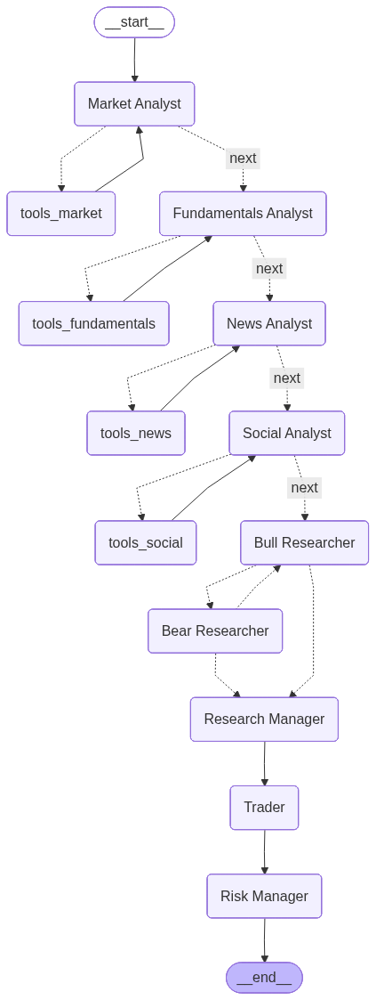

# 📊 nanoTradingAgents-CN股票分析系统

> 精简自 [TradingAgents-CN](https://github.com/hsliuping/TradingAgents-CN)，仅保留**单股分析**流程，去掉了界面、数据库等非必要内容，便于学习基于LangGraph构建智能体的基本流程，同时该项目也具备一定的投顾能力，可用于A股、港股、美股分析。

## 🎯 项目简介

本系统基于多智能体 LLM 架构，通过模拟专业投资团队的分析流程，对单只股票进行全面分析并给出投资建议。

## 🔄 分析流程

```
START
  ↓
┌─────────────────────────────────┐
│  四位分析师 (数据获取+分析)        │
│  📊 市场分析师 → 技术指标分析      │
│  💼 基本面分析师 → 财务数据分析     │
│  📰 新闻分析师 → 新闻事件分析      │
│  💬 社交媒体分析师 → 投资者情绪分析  │
└─────────────────────────────────┘
  ↓
┌─────────────────────────────────┐
│  多空投资辩论 (多轮)              │
│  🐂 看涨研究员 ⇄ 🐻 看跌研究员    │
└─────────────────────────────────┘
  ↓
👔 研究经理 → 综合投资决策
  ↓
💼 交易员 → 具体交易执行计划
  ↓
🎯 风险管理经理 → 风险评估与控制
  ↓
END
```



## 📁 项目结构

```
stock_analyzer/
├── analyzer.py              # 🔥 核心入口 - StockAnalyzer 类
├── config.py                # 配置管理
├── run.py                   # 命令行入口
├── requirements.txt         # Python 依赖
│
├── graph/                   # LangGraph 工作流
│   └── builder.py           # 🔥 工作流构建 - 图的节点和边
│
├── agents/                  # 智能体定义
│   ├── analysts/            # 四位分析师
│   │   ├── market_analyst.py        # 市场技术分析
│   │   ├── fundamentals_analyst.py  # 基本面分析
│   │   ├── news_analyst.py          # 新闻分析
│   │   └── social_media_analyst.py  # 社交媒体情绪分析
│   ├── researchers/          # 研究员
│   │   ├── bull_researcher.py       # 🐂 看涨研究员
│   │   └── bear_researcher.py       # 🐻 看跌研究员
│   ├── managers/             # 管理者
│   │   ├── research_manager.py      # 👔 研究经理（投资决策）
│   │   └── risk_manager.py          # 🎯 风险管理经理
│   ├── trader/               # 交易员
│   │   └── trader.py                # 💼 交易员
│   └── utils/                # 工具
│       └── agent_states.py           # 状态定义
│
├── dataflows/               # 数据获取
│   └── tools.py             # 股票数据工具 (A股/美股/港股)
│
└── results/                 # 分析结果输出目录
    ├── {stock}_{date}.json  # 完整 JSON 数据
    └── {stock}_{date}.md    # Markdown 报告
```

## 🚀 快速开始

### 1. 安装依赖

```bash
cd stock_analyzer
pip install -r requirements.txt
```

### 2. 配置环境变量

系统使用 `python-dotenv` 自动加载环境变量，推荐使用 `.env` 文件进行配置：

```bash
# OPENAI_API_KEY=your-api-key
# LLM_PROVIDER=openai
# LLM_MODEL=gpt-4o
```

*(你也可以直接通过 `export OPENAI_API_KEY='your-api-key'` 的方式临时设置环境变量)*

### 3. 运行分析

```bash
# 分析美股
python run.py AAPL

# 分析A股
python run.py 600519

# 分析港股
python run.py 00700

# 指定日期
python run.py NVDA --date 2025-03-31
```

### 4. 输出结果
输出样例可见 `demo_result.md`

## ⚙️ 配置说明

| 环境变量 | 说明 | 默认值 |
|---------|------|--------|
| `LLM_PROVIDER` | LLM 提供商 | `openai` |
| `OPENAI_API_KEY` | API 密钥 | (必填) |
| `BACKEND_URL` | API 基础 URL | `https://api.openai.com/v1` |
| `MAX_DEBATE_ROUNDS` | 辩论轮次 | `1` |
| `LOG_LEVEL` | 日志级别 | `INFO` |

## 🌐 支持的 LLM

任何兼容 OpenAI API 格式的模型都可以使用（请在 `.env` 中配置）：

| 提供商 | `.env` 配置示例 |
|--------|---------|
| OpenAI | `LLM_PROVIDER=openai`<br>`LLM_MODEL=gpt-4o` |
| DeepSeek | `LLM_PROVIDER=openai`<br>`LLM_MODEL=deepseek-chat`<br>`BACKEND_URL=https://api.deepseek.com/v1` |
| 通义千问 | `LLM_PROVIDER=openai`<br>`LLM_MODEL=qwen-plus`<br>`BACKEND_URL=https://dashscope.aliyuncs.com/compatible-mode/v1` |
| 智谱AI | `LLM_PROVIDER=openai`<br>`LLM_MODEL=glm-4`<br>`BACKEND_URL=https://open.bigmodel.cn/api/paas/v4` |
| 本地 Ollama | `LLM_PROVIDER=openai`<br>`LLM_MODEL=llama3`<br>`BACKEND_URL=http://localhost:11434/v1` |

## 📊 数据源

| 数据源 | 库 | 支持市场 |
|--------|---|---------|
| A股行情 | `baostock` | 沪深A股 |
| 美股/港股行情 | `yfinance` | 美股、港股 |
| 新闻搜索 | `duckduckgo-search` | 全市场 |

## ⚠️ 免责声明

- 本系统仅供学习和研究使用
- 所有分析结果均由 AI 生成，**不构成投资建议**
- 投资有风险，决策需谨慎

